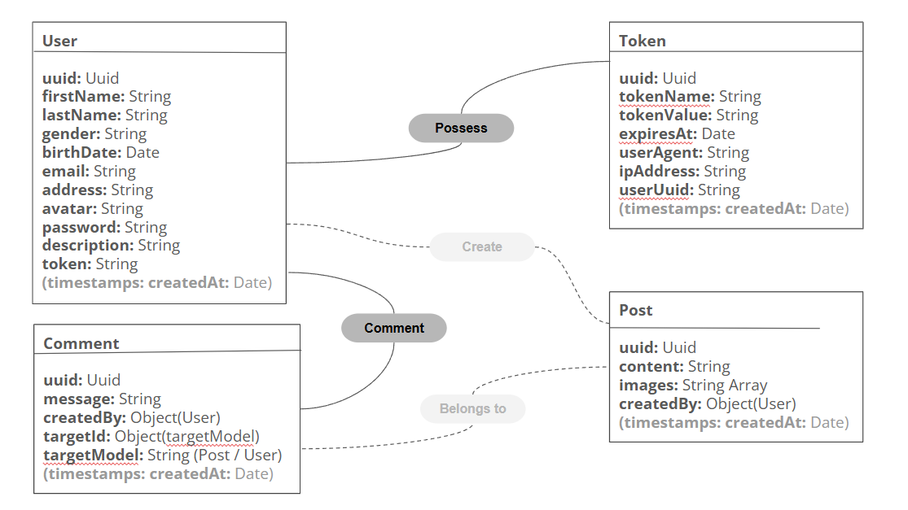

# Hackathon_Social_Media# Hackathon_Social_Media

> Small social media project

- [Hackathon\_Social\_Media# Hackathon\_Social\_Media](#hackathon_social_media-hackathon_social_media)
  - [Members of the project](#members-of-the-project)
  - [Built with](#built-with)
  - [Routes](#routes)
    - [Routes available in frontend](#routes-available-in-frontend)
    - [Routes available in backend](#routes-available-in-backend)
      - [Sign Up / Login](#sign-up--login)
      - [User](#user)
      - [Comments](#comments)
      - [Posts](#posts)
      - [Tokens](#tokens)
  - [Links Vercel](#links-vercel)
  - [Data Schema](#data-schema)
    - [Relations](#relations)

## Members of the project

- [Thomas MARQUES](https://github.com/MarquesThomasCoding)
- [Mohsen HOSEN](https://github.com/HosenMohsen)
- [Talyha MOREAU](https://github.com/Tay9875)
- [Roland HUON](https://github.com/Roland-HUON)

## Built with

This project uses the following languages, frameworks and tools:
1. Node.js
2. Vue
3. Vercel
4. Express
5. MongoDB & Mongoose
6. Swagger
7. Cors
8. Bcrypt
9. Uuid
10. Vite
11. Vue Router
12. Tailwind
13. Chart.js

## Routes

Find all the api routes by clicking on the following link: [Route documentation with Swagger](https://hackathon-social-media-backend-phi.vercel.app/api-docs/#/Auth/post_auth_login)

Below you will find all available routes. Please refer to the Swagger documentation for more detailed information about the backend routes.

### Routes available in frontend

- [https://hackathon-social-media-frontend-iota.vercel.app/](https://hackathon-social-media-frontend-iota.vercel.app/)
- [https://hackathon-social-media-frontend-iota.vercel.app/login/](https://hackathon-social-media-frontend-iota.vercel.app/login/)
- [https://hackathon-social-media-frontend-iota.vercel.app/signup/](https://hackathon-social-media-frontend-iota.vercel.app/signup/)
- [https://hackathon-social-media-frontend-iota.vercel.app/profile/](https://hackathon-social-media-frontend-iota.vercel.app/profile/)
- https://hackathon-social-media-frontend-iota.vercel.app/profile/{uuid}
- [https://hackathon-social-media-frontend-iota.vercel.app/statistics/](https://hackathon-social-media-frontend-iota.vercel.app/statistics/)
- [https://hackathon-social-media-frontend-iota.vercel.app/logout/](https://hackathon-social-media-frontend-iota.vercel.app/logout/)

### Routes available in backend

#### Sign Up / Login

- (Method POST) Sign Up : .../auth/signup/
- (Method POST) Login : .../auth/login/

#### User

- (Method GET) Get all users : .../api/users/
- (Method GET + need token) Get a specific user : .../api/users/{uuid}
- (Method GET) Get the connected user : .../api/users/me
- (Method POST) Create a new user : .../api/users/
- (Method PUT + need token) Update a user : .../api/users/
- (Method DELETE + need token) Delete a user : .../api/users/

#### Comments

- (Method GET) Get all comments : .../api/comments/
- (Method GET) Get a specific comment : .../api/comments/{uuid}
- (Method GET) Get comments of a specific users profile : .../api/comments/profile/{uuid}
- (Method GET) Get comments of a specific post : .../api/comments/post/{uuid}
- (Method POST + need token) Create a comment on a user profile : .../api/comments/profile/{uuid}
- (Method POST + need token) Create a comment on a post : .../api/comments/post/{uuid}
- (Method PUT + need token) Update a comment : .../api/comments/{uuid}
- (Method DELETE + need token) Delete a comment : .../api/comments/{uuid}

#### Posts

- (Method GET) Get all posts : .../api/posts/
- (Method GET) Get a specific post : .../api/posts/{uuid}
- (Method GET) Get posts of a specific user : .../api/posts/profile/{uuid}
- (Method POST + need token) Create a new post : .../api/posts/
- (Method PUT + need token) Update a post : .../api/posts/{uuid}
- (Method DELETE + need token) Delete a post : .../api/posts/{uuid}

#### Tokens

- (Method GET) Get all tokens : .../api/tokens/
- (Method GET) Get a specific token : .../api/tokens/
- (Method GET + need token) Check if the token is valid : .../api/tokens/check/
- (Method POST) Create a new token : .../api/tokens/
- (Method DELETE + need token) Delete a token : .../api/tokens/

## Links Vercel

Link frontend Vercel : [https://hackathon-social-media-frontend-iota.vercel.app/](https://hackathon-social-media-frontend-iota.vercel.app/)
Link backend Vercel : [https://hackathon-social-media-backend-phi.vercel.app/](https://hackathon-social-media-backend-phi.vercel.app/)

## Data Schema

### Relations

- One-to-Many : User (_id because of ObjectId) -> Post (createdBy)
- One-to-Many : User (_id because of ObjectId) -> Comment (createdBy)
- One-to-Many : User (uuid) -> Token (userUuid)
- One-to-Many : Post (_id) -> Comment (targetId + targetModel="post")
- Polymorphique : Comment -> User || Post

## Deployment Strategy

We use Vercel for deployment, configured to trigger deployments only when changes are made to the respective frontend or backend folders.